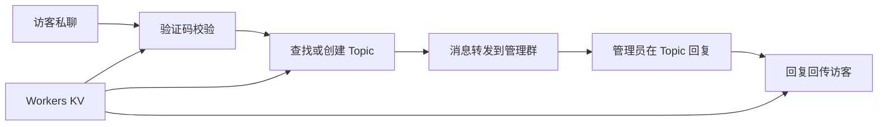

# RelayBot

RelayBot 是一个轻量的 Telegram 私聊转发 Bot，基于 Cloudflare Workers 与 Workers KV 运行。访客私聊机器人，消息自动转发到管理群的独立话题；管理员在话题内回复，访客即可收到。单管理员、低维护、免服务器。

## 快速安装

1. 打开 Cloudflare Workers & Pages，新建 Worker。
2. 新建 KV Namespace，命名为 `BOT_KV`。
3. 在 Worker 的 Bindings 中绑定 `BOT_KV`，绑定变量名填写 `KV`（源码读取 `env.KV`，不能填 `BOT_KV`）。
4. 在 Worker 的 Settings / Variables and Secrets 配置：

| 变量名 | 类型 | 值 | 说明 |
| --- | --- | --- | --- |
| `BOT_TOKEN` | Secret | `{BOT_TOKEN}` | BotFather 提供的 Token |
| `MY_ID` | Variable | `{MY_ID}` | 管理超级群 ID，通常以 `-100` 开头 |
| `ADMIN_UID` | Variable | `{ADMIN_UID}` | 管理员个人数字 UID |
| `SECRET_TOKEN` | Secret | `{SECRET_TOKEN}` | Webhook 校验密钥，建议 32–64 位随机字符 |

5. 将 `relay_v1.txt` 全文粘贴到代码编辑器，保存并部署。
6. 浏览器打开 Worker 地址，正常返回 `RelayBot Standby`。
7. 激活 Webhook（替换占位符后浏览器打开）：

```text
https://api.telegram.org/bot{BOT_TOKEN}/setWebhook?url={YOUR_WORKER_URL}&secret_token={SECRET_TOKEN}&allowed_updates=%5B%22message%22%2C%22edited_message%22%2C%22callback_query%22%5D
```

8. 在管理群发送 `/init`，然后让一名访客私聊 Bot 完成验证码验证。

## 主要功能

| 功能 | 说明 |
| --- | --- |
| 私聊留言转发 | 访客私聊消息自动转发到管理群对应话题 |
| 验证码防骚扰 | 访客需回复验证码，验证码文本可点击复制，5 分钟有效 |
| Topic 包厢 | 每个访客独立话题，回复自动回传访客 |
| 黑名单 | 管理群内 `/ban` 拉黑、`/unban` 解封 |
| 控制面板 | 帮助、报错、状态三入口，旧面板自动退役 |
| 限流防刷 | 短时间高频消息自动拦截并提示 |
| KV 持久化 | 映射、验证、黑名单与错误日志全部存入 KV |

## 工作流程



## 日常管理

管理群内发送：

| 命令 | 用途 |
| --- | --- |
| `/init` | 初始化并重新收口命令作用域 |
| `/status` | 查看版本、黑名单数与最近报错 |
| `/errors` | 查看最近 5 条报错日志 |
| `/help` | 查看完整指令集 |
| `/ban` 或 `/拉黑` | 封禁指定访客 |
| `/unban` 或 `/解封` | 解封指定访客 |
| `/resetverify` 或 `/重置验证` | 重置访客验证状态 |

## 数据与稳定性

- 访客映射、验证状态、黑名单和错误日志全部保存在 KV。
- 重装或升级时必须继续绑定原 `BOT_KV`，否则数据从空白开始。
- Webhook 更新按 `update_id` 幂等去重，避免重复处理。
- 错误日志每条独立 KV 键，自动过期，不互相覆盖。

## 安全说明

- 仓库不包含 Token、密钥、环境变量或运行时数据。
- `SECRET_TOKEN` 必须与 `setWebhook` 参数完全一致，否则请求返回 403。
- 部署时不要把真实凭据提交到 Git。

## 许可证

MIT License
